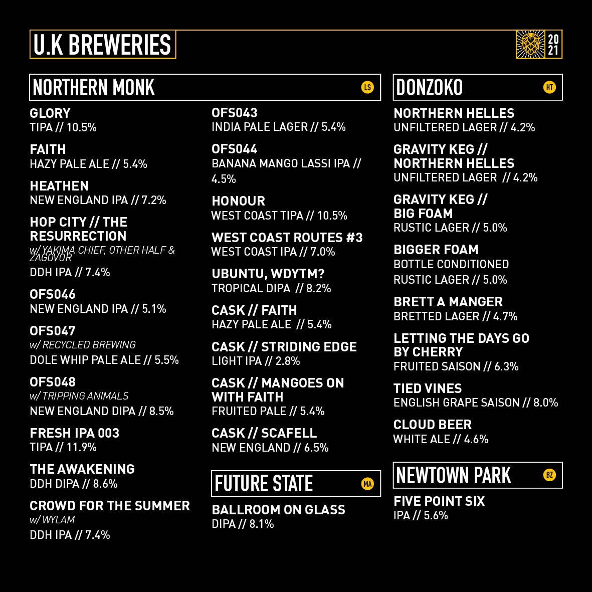
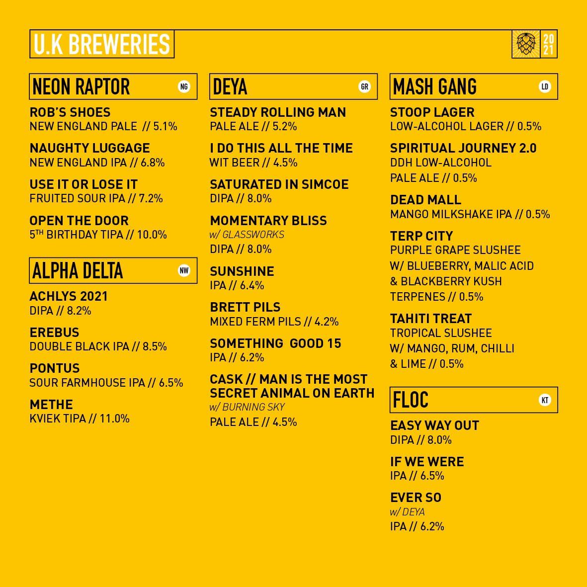

# Hop City 2021

EDIT: Currently hosting the webpages for 7 days at:

- [Breweries](https://hopcitybreweries.tiiny.site)
- [Beers](https://hopcitybeers.tiiny.site)

I knocked up a quick pair of data tables based on the info Northern Monk published on [Twitter](https://twitter.com/HopCityLeeds) about which breweries & beers are going to be at Hop City 2021.

This code can query Untappd & get back the brewery & beer info.

Some data is missing & is a mix of bad coding & poorly named beer (blame Northern Monk lol) - sorry!

Possibly could have asked NM for a spreadsheet with all the beer in, but I hand cranked that. (beer.csv)

Tried out some OCR, but found they were all useless.

Anyway clone this repo & load up [breweries](brewery.html) or [beer](beer.html). The data contained is static & extracted from Untappd. 

Sorry for any data that is inaccurate & for the UI!

See you at [Hop City 2021](https://northernmonk.com/events/hop-city-2021/)!

